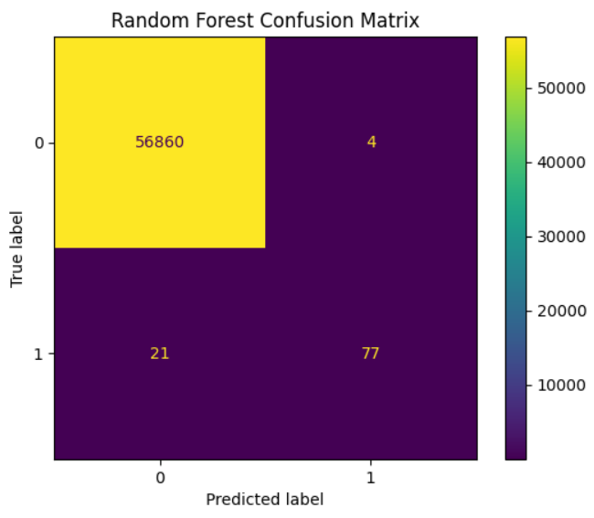
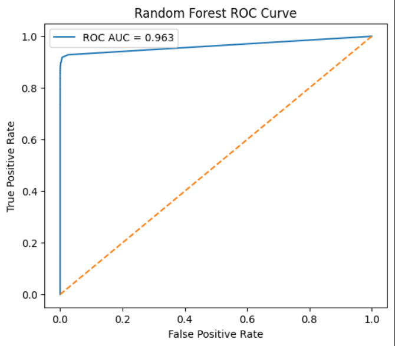
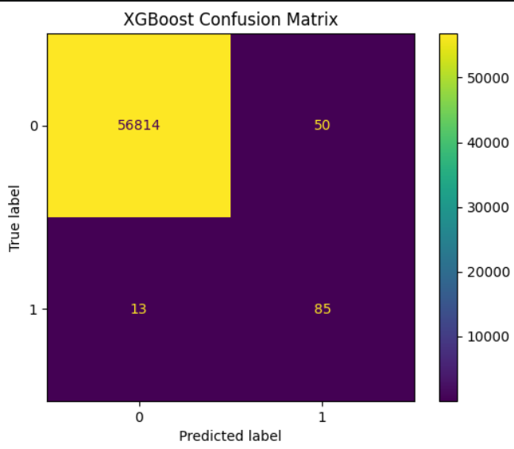
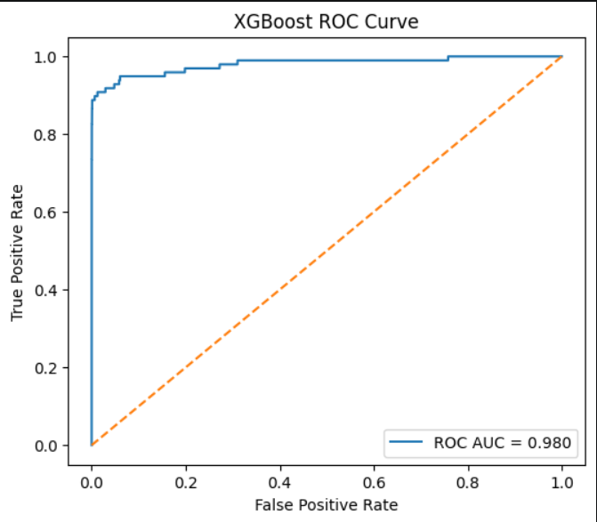
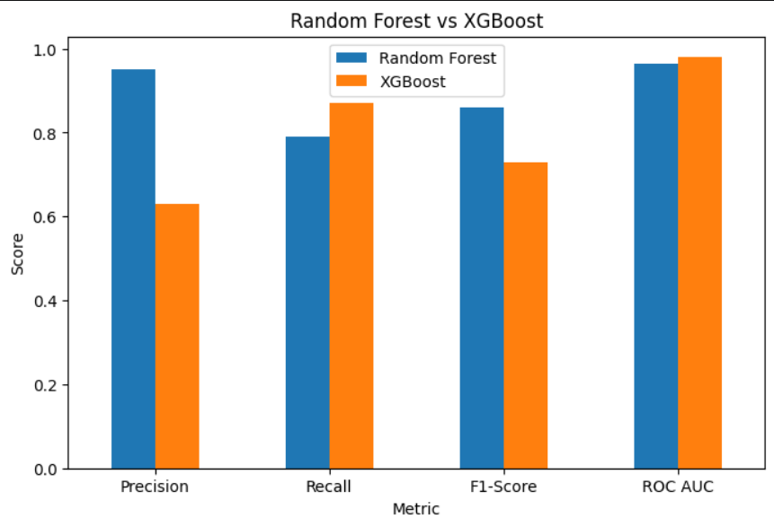

# Credit Card Fraud Detection using Machine Learning

## Project Overview

Credit card fraud is a major challenge in the banking industry because fraudulent transactions make up only a very small percentage of all transactions. In this project, I built a machine learning model to identify fraudulent credit card transactions using the publicly available Kaggle Credit Card Fraud Detection dataset.

The project covers the complete machine learning workflow, including data exploration, preprocessing, model training, and evaluation. A Random Forest Classifier was used to classify transactions as either legitimate or fraudulent, and its performance was evaluated using several classification metrics.

---

## Dataset

The dataset used in this project was downloaded from **Kaggle**.

- **Total Transactions:** 284,807
- **Legitimate Transactions:** 284,315
- **Fraudulent Transactions:** 492

The dataset contains anonymized features (`V1`–`V28`) generated using PCA, along with **Time**, **Amount**, and the target column **Class**.

- **Class = 0** → Legitimate Transaction
- **Class = 1** → Fraudulent Transaction

> **Note:** The dataset is not included in this repository. You can download it from Kaggle and place it in the project folder before running the notebook.

---

## Technologies Used

- Python
- Pandas
- NumPy
- Matplotlib
- Scikit-learn
- Jupyter Notebook

---

## Project Workflow

- Load and explore the dataset
- Analyze the class imbalance
- Preprocess the data
- Split the dataset into training and testing sets
- Train a Random Forest model
- Evaluate the model using multiple performance metrics
- Compare results with XGBoost

---

## Machine Learning Models

- Random Forest Classifier
- XGBoost Classifier (for comparison)

---

## Model Performance

| Metric | Score |
|---------|--------|
| Accuracy | **99.96%** |
| Precision | **95%** |
| Recall | **78%** |
| F1-Score | **85%** |
| ROC-AUC | **0.97** |

These results show that the model performs well despite the highly imbalanced nature of the dataset.

---

## Visualizations

### Data Analysis

<p align="center">
  
  
</p>

<p align="center">
  
</p>

---

### Random Forest Results

<p align="center">
  
  
</p>

---

### XGBoost Results

<p align="center">
  
  
</p>

---

### Model Comparison

<p align="center">
  
</p>
## Project Structure

```
Credit-Card-Fraud-Detection/
│
├── credit_card_fraud_detection.ipynb
├── README.md
├── requirements.txt
├── graphs/
└── .gitignore
```

---

## How to Run

Clone the repository:

```bash
git clone https://github.com/sankalpvaish43/Credit-Card-Fraud-Detection.git
```

Move into the project directory:

```bash
cd Credit-Card-Fraud-Detection
```

Install the required libraries:

```bash
pip install -r requirements.txt
```

Run the notebook:

```bash
jupyter notebook
```

---

## Acknowledgements

This project uses the Credit Card Fraud Detection dataset provided on Kaggle. Thanks to the dataset contributors for making it publicly available for educational and research purposes.

---

## Author

**Sankalp Vaish**

B.Tech CSE (Artificial Intelligence)

GitHub: https://github.com/sankalpvaish43
